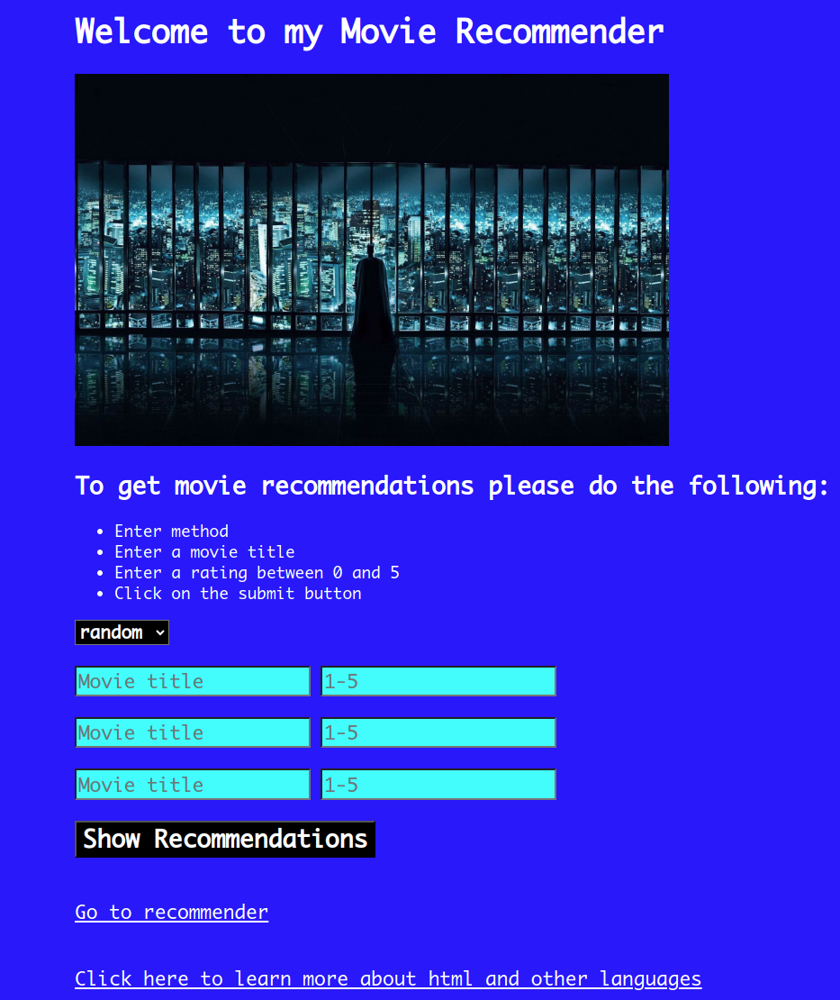

# 🎬 Movie Recommender Web App

This is a simple web-based movie recommender application built using **Flask**. It recommends movies to users based on four strategies: **random selection**, **popularity**, **clustering**, and **non-negative matrix factorization (NMF)**.

---

## 🚀 Features

- 📊 Four recommendation methods:
  - `random`: randomly selects movies
  - `popular`: recommends generally liked movies
  - `cluster`: recommends movies based on clustering of preferences
  - `factor`: recommends using non-negative matrix factorization
- 🎥 Searchable dropdown for movie titles
- ⭐ User rating input for personalized recommendations
- 🌐 Lightweight and easy-to-deploy Flask backend
- 🎨 Simple and clean UI with custom CSS and background image

---

## 📁 Project Structure

```markdown
movie-recommender/
├── data/
│   └── movies.csv               # Movie dataset with movieId, title, and genres
├── static/
│   ├── styling_with_css.css     # Custom CSS styling
│   └── WallpaperDog-11036502.jpg# Background image
│   └── landing-page.png# preview of how the landing page looks
├── templates/
│   ├── landing_page.html        # Homepage for user input
│   └── recommender.html         # Output page with recommendations
├── application.py               # Main Flask app
├── recommender.py               # MovieRecommender class and logic
├── utils.py                     # Recommendation algorithm implementations
├── requirements.txt             # Python dependencies
├── Procfile                     # For deployment (e.g., Heroku)
├── Procfile.windows             # Windows-compatible Procfile
├── .gitignore                   # Git ignore rules
├── LICENSE                      # MIT License
└── README.md                    # Project documentation
```

## 🧠 Recommendation Logic
Located in `utils.py`, these functions handle recommendation logic:

- `get_random_movies()`: Shuffles all movies and returns top N

- `get_popular_movies(user_rating_dict)`: Placeholder for popularity logic

- `get_cluster_movies(user_rating_dict)`: Placeholder for clustering logic

- `get_nmf_movies(user_rating_dict)`: Placeholder for NMF-based recommendations

You can expand the placeholder methods with actual ML models or data analysis.


## 🧪 Example Usage

### Start the server:
```
python application.py
```
Then visit: http://127.0.0.1:5000/

1. Select a recommendation method

2. Input up to 3 movie titles and assign each a rating (0–5)

3. Submit the form to see your recommendations

## 📦 Installation
1. Clone the repository
```
git clone https://github.com/karianjahi/movie_recommender_app.git
cd movie-recommender-app
```

2. Set up a virtual environment (optional but recommended)
```
python -m venv venv
source venv/bin/activate  # On Windows use `venv\Scripts\activate`
```

3. Install dependencies
```
pip install -r requirements.txt
```

4. Run the app locally
```
python application.py
```

## 🌍 Deployment
This app is ready for deployment on platforms like Heroku. Make sure the following files exist:

- `Procfile`
- `requirements.txt`

Heroku deployment steps (assumes Heroku CLI is installed):

```
heroku login
heroku create movie-recommender-app
git push heroku main
heroku open
```

## 📄 License
This project is licensed under the MIT License.

## 🙋‍♂️ Author
Dr.rer.nat Joseph Karianjahi Njeri

If you'd like to contribute or offer feedback, feel free to open an issue or submit a pull request.

## ✅ To-Do
- Implement real recommendation logic for popular, cluster, and factor

- Add unit tests for core functionality

- Improve front-end styling and responsiveness

- Allow dynamic number of rating inputs

- Add user authentication for saving preferences

## 🖼 Preview


Built with ❤️ using Python and Flask.

